## 🚗 Garage Management System

The Garage Management System is a software application designed to streamline and automate the daily operations of an automobile service center. It helps manage customer information, vehicle records, service requests, and billing in an organized and efficient way.

The system allows garage staff to easily track ongoing repairs, assign tasks to mechanics, and maintain service history for each vehicle. It also simplifies invoice generation and improves communication between customers and service providers.

With a user-friendly interface and structured data management, the application enhances productivity, reduces manual errors, and ensures a smooth workflow within the garage.

## 🌐 Live Demo

  <a href="https://garage.leedforce.com" target="_blank" rel="noopener noreferrer">
    🔗 Open Live Demo
  </a>

## 🔐 Demo Credentials

| Field    | Value              |
|----------|--------------------|
| Email    | demo@gmail.com     |
| Password | 1414               |

## 📸 Screenshots

### Booking Form
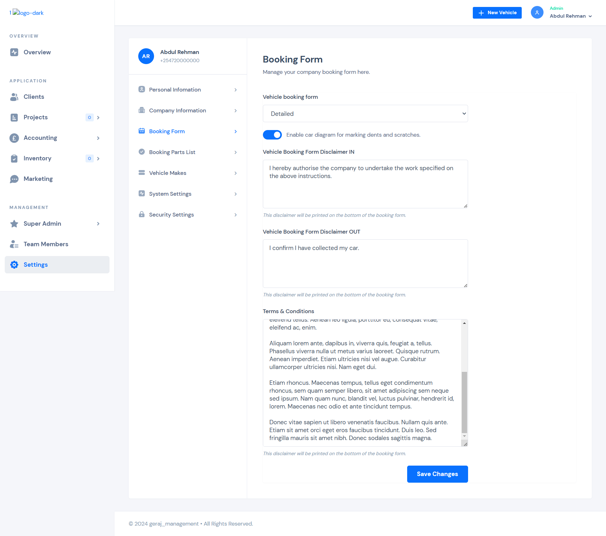

### Client -list
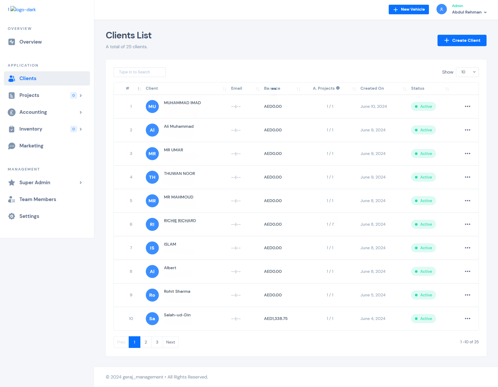

### Company info
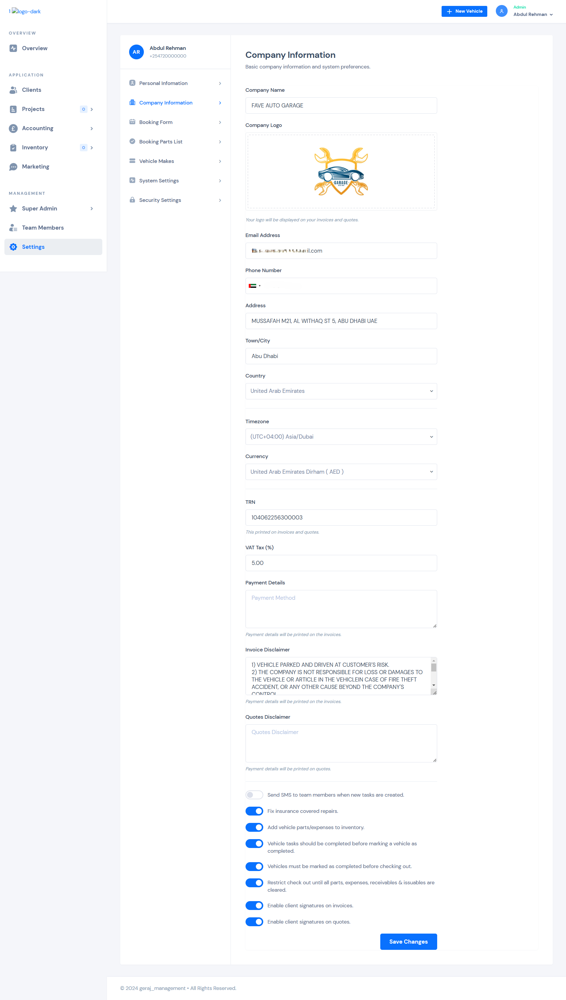

### Company-list
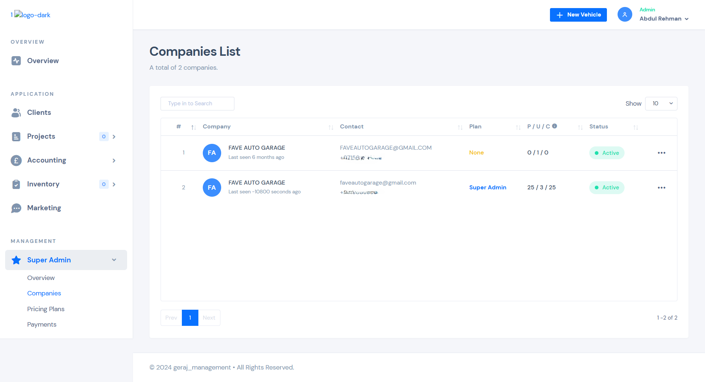

### Expenses
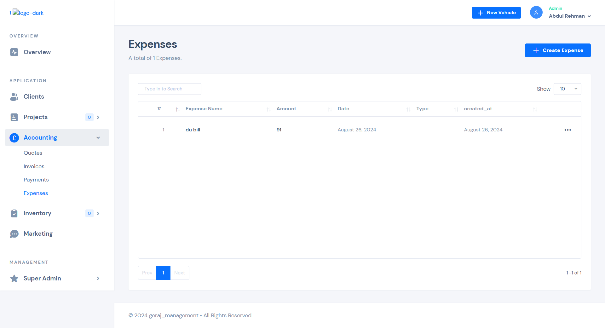

### Invoices
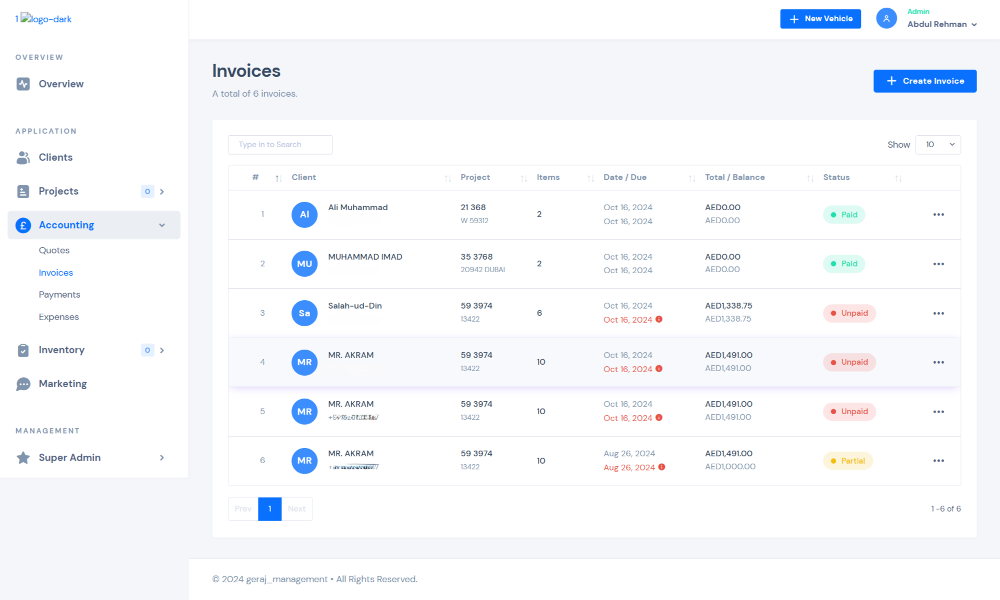

### Marketing
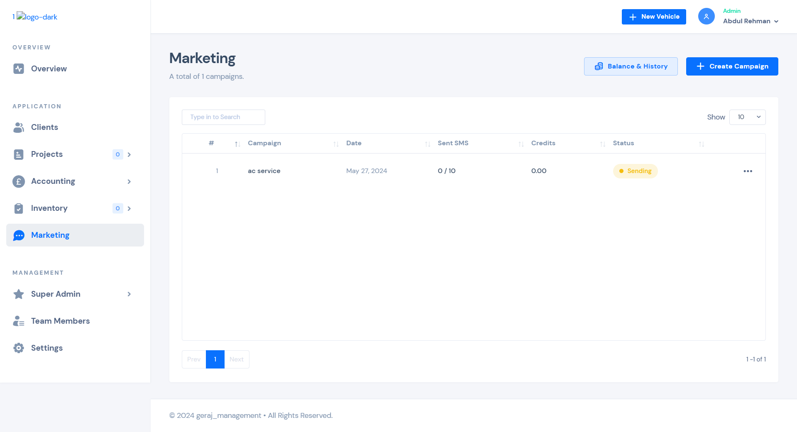

### Payments
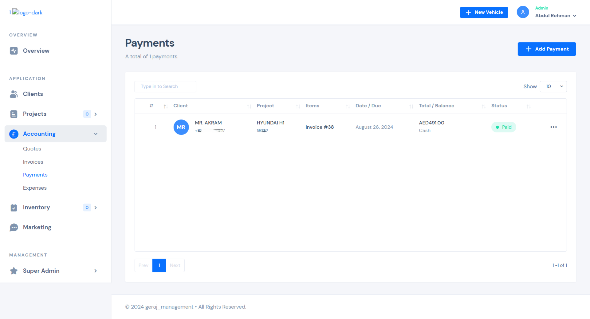

### Personal-info
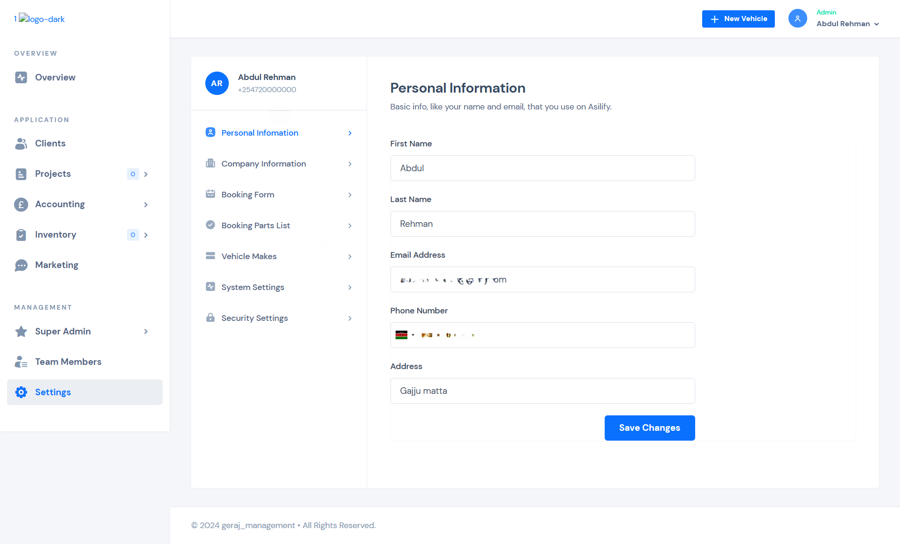

### Pricing-plan
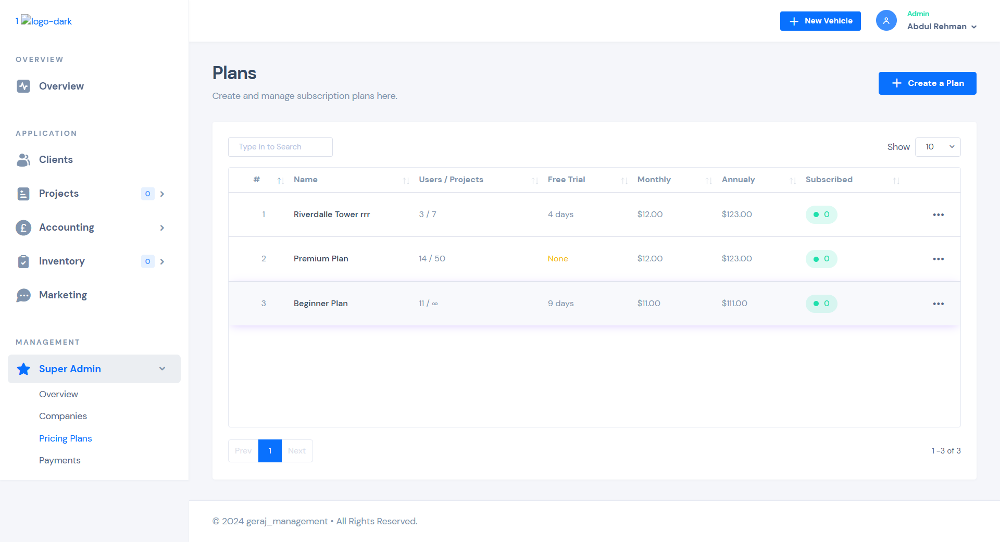

### Project-list
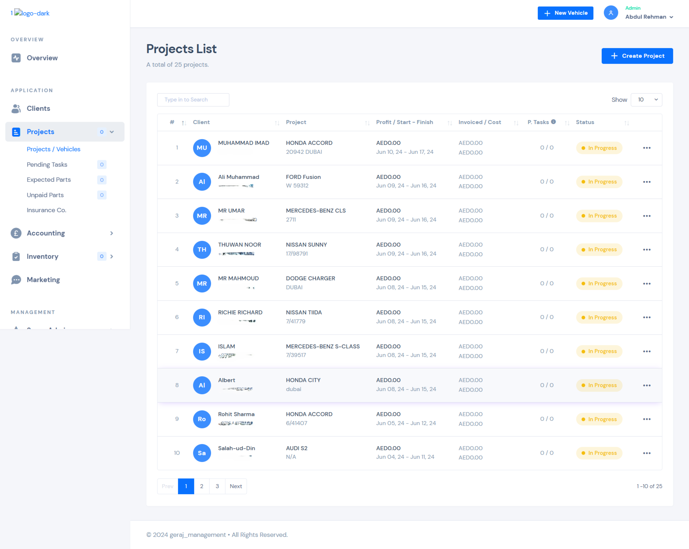

### Quoets
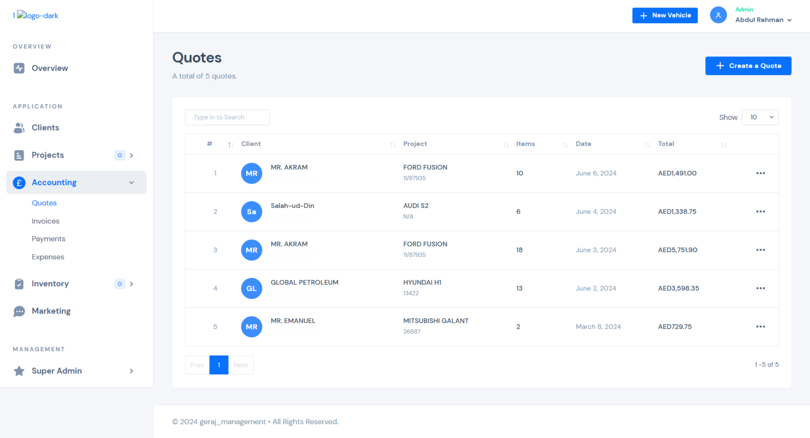

### Suppliers
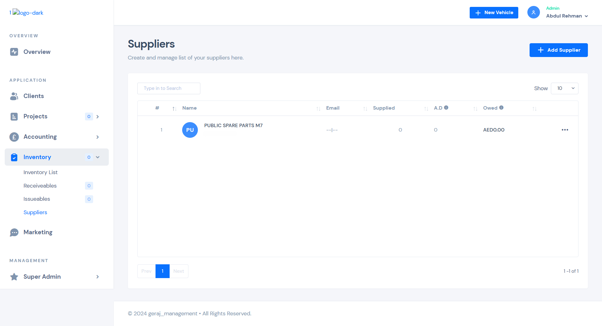

### System-settings
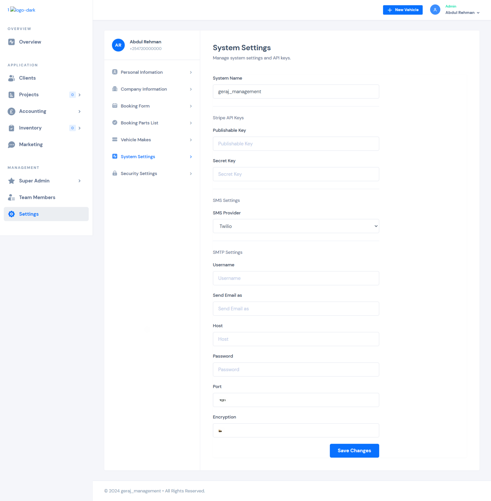

### Team-members
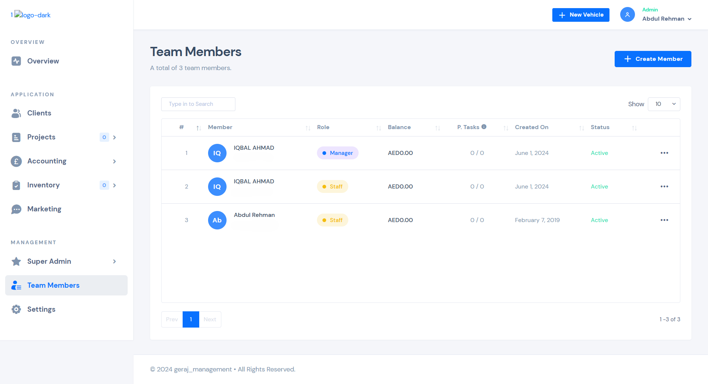

### Vehicle makes
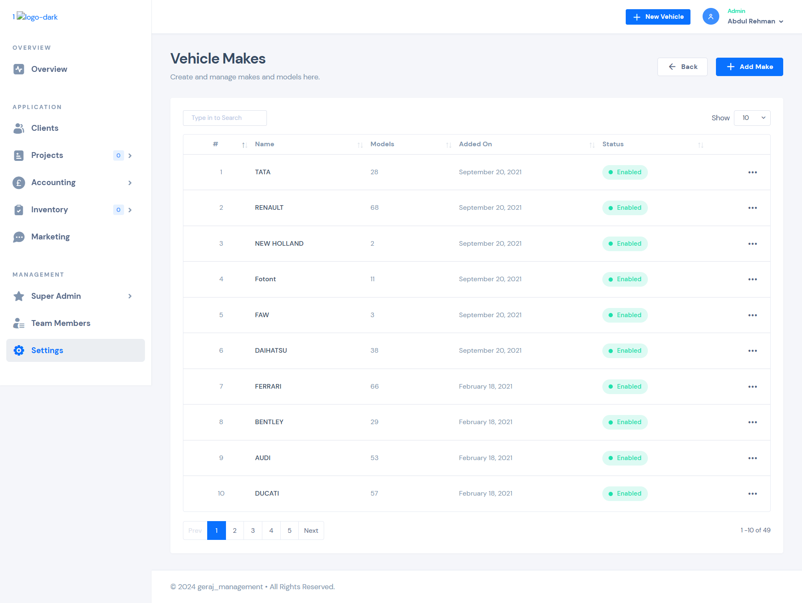

## 📫 Let’s Connect

* 📧 **Email:** [sherz12r@gmail.com](mailto:sherz12r@gmail.com)
* 💬 **WhatsApp:** [Chat on WhatsApp](https://wa.me/971527861045)
* 💼 **LinkedIn:** [https://www.linkedin.com/in/sherz12r](https://www.linkedin.com/in/sherz12r)